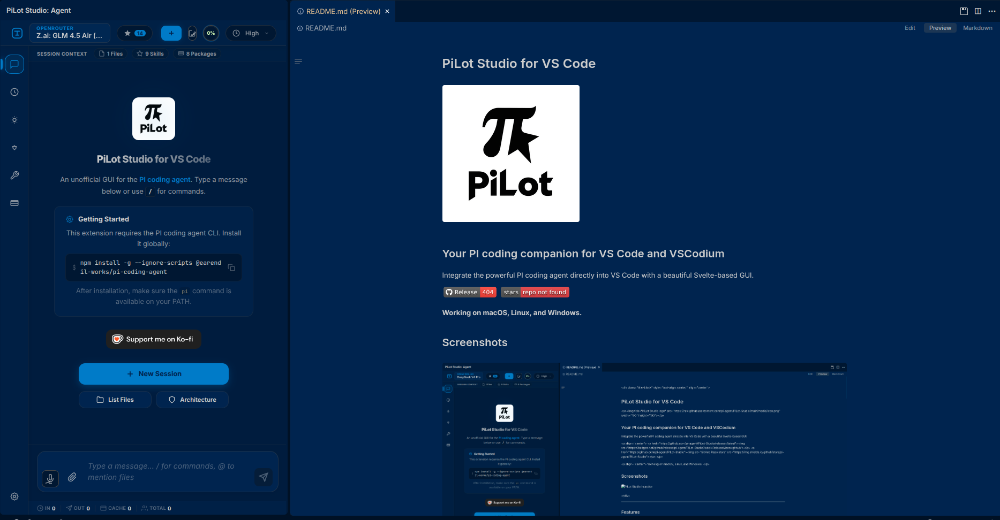

# PiLot Studio


**Your AI coding companion for VS Code**

Bring the power of PI directly into your editor with a modern, intuitive interface. Chat with your AI assistant, navigate your coding history, and supercharge your workflow—all without leaving VS Code.

[](https://github.com/Printaga/PiLot/releases/latest) [](https://github.com/Printaga/PiLot)

Works on Windows, Linux, and macOS.



---

## Work smarter, not harder

PiLot Studio brings the PI coding agent into VS Code so you can:

- **Code faster** — Let AI handle boilerplate, refactoring, and repetitive tasks
- **Understand any codebase** — Get instant explanations and project analysis
- **Stay in flow** — No context switching between your editor and browser
- **Work your way** — Supports multiple AI providers with model selection and customizable behavior

---

## Key Features

### 💬 AI Chat, right in your editor

Interactive conversations with PI in a native VS Code panel. Ask questions, get code explanations, and iterate without breaking focus.

### 🌳 Navigate your history

A conversation tree lets you branch, revisit, and organize past sessions. Pick up where you left off or explore different approaches.

### 🤖 Your choice of AI

Supports Anthropic, OpenAI, Google, and compatible providers, with quick model cycling and adjustable thinking levels.

### 🎙️ Voice dictation

Talk to your AI with built-in speech-to-text powered by Whisper. Works completely offline—your audio never leaves your device.

### 🔧 Full control over tools

Enable, disable, or restrict PI's capabilities per session. Fine-tune what the AI can and can't do.

### 📦 Extend with packages

Install extensions, skills, and prompt templates from the PI community to make PI even more powerful.

### 📎 Smart context

Paste files, drag-and-drop images, or type `@` to mention files in your workspace. The AI automatically understands what you're working on.

---

## Getting Started in 5 minutes

### 1. Install PI

Follow the [PI installation guide](https://pi.dev) to set up the `pi` CLI on your machine.

### 2. Install PiLot Studio

Search for **"PiLot Studio"** in the VS Code Extensions marketplace and click Install.

### 3. Add your API key

Set your AI provider API key as an environment variable:

```bash
export ANTHROPIC_API_KEY=sk-ant-...
# or
export OPENAI_API_KEY=sk-...
```

You can also configure this through the PiLot Studio settings panel.

### 4. Open PiLot Studio

Press `Ctrl+Shift+Alt+P` (`Cmd+Shift+Alt+P` on macOS), then start chatting.

**That's it!** You're ready to code with AI.

---

## Keyboard Shortcuts

| Shortcut           | Action                 |
| ------------------ | ---------------------- |
| `Ctrl+Shift+Alt+P` | Open PiLot Studio      |
| `Ctrl+Shift+I`     | Focus chat input       |
| `Ctrl+Shift+Alt+N` | New session            |
| `Ctrl+Shift+;`     | Toggle voice dictation |
| `Ctrl+Shift+A`     | Add file to chat       |

(macOS: use `Cmd` instead of `Ctrl`)

---

## Right-Click Commands

No need to memorize keyboard shortcuts—just right-click in VS Code:

- **Explain Code with PI** — Highlight code, right-click, and get an instant explanation
- **Refactor Code with PI** — Select code and let AI suggest improvements
- **Analyze Project with PI** — Right-click any folder to analyze your entire project
- **Add File to Chat** — Attach any file to your conversation with one click

---

## Configuration

Everything is configurable under `pi-agent.*` settings. Key options:

### Runtime

- **Binary path** — Custom location for the `pi` executable
- **Agent directory** — Where PI stores its data
- **Auto-update** — Keep PI up to date automatically
- **Offline mode** — Use PI without network access

### Session

- **Thinking level** — Control how deep PI reasons (minimal → xhigh)
- **Tool access** — Restrict what PI can do (read-only, custom, or full)
- **Auto-compact** — Automatically manage conversation context
- **Auto-retry** — Retry on transient errors automatically

### Context

- **Auto-attach editor context** — PI automatically sees what you're working on
- **Include diagnostics** — Surface errors and warnings to the AI
- **Include git status** — Give PI awareness of recent changes

### Dictation

- **Enable microphone** — Toggle voice input on or off
- **Choose model** — Switch between lightweight and high-accuracy Whisper models

---

## Troubleshooting

**PI not detected?**

- Ensure `pi` is installed and available on your PATH
- Set `pi-agent.binaryPath` if it's in a non-standard location

**API requests failing?**

- Verify your API key is set and correct (environment variable or PI config)
- Restart the extension after updating keys

**Dictation unavailable?**

- Make sure microphone access is enabled for VS Code in your OS settings
- Enable `pi-agent.voice.enabled` in settings

**Sessions look wrong?**

- Check that `pi-agent.agentDir` points to the correct directory
- Restart the extension after changing agent directories

---

## Development

Built with Svelte 5, Vite 8, and TypeScript 6.

```bash
# Setup
pnpm install

# Build everything
pnpm run build

# Watch mode for development
pnpm run webview:dev
```

Or run the full test suite with `pnpm test`.

---

## Privacy First

PiLot Studio respects your privacy:

- **Voice dictation runs completely offline** — your audio never leaves your machine
- **Your API keys stay yours** — managed by PI, not by us
- **No telemetry** unless you explicitly enable diagnostics

---

## Contributing

Got an idea or found a bug?

- Open an issue at [github.com/Printaga/PiLot/issues](https://github.com/Printaga/PiLot/issues)
- Submit a pull request with improvements

We welcome all contributions!

---

## License

[Apache-2.0](LICENSE)
