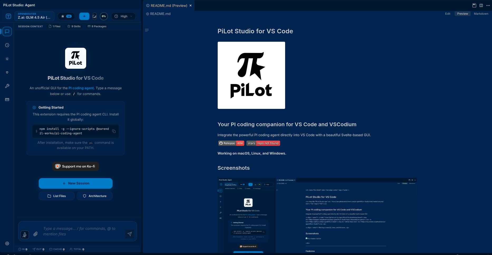

# PiLot Studio


**A VS Code sidebar for the PI coding agent.**

Chat about your workspace, let PI use coding tools, revisit branched sessions, and manage models and packages without leaving your editor.

[](https://github.com/Printaga/PiLot/releases/latest) [](https://github.com/Printaga/PiLot)

Official website: **[pivscode.com](https://pivscode.com/)**

Works with VS Code 1.85 or newer on Windows, Linux, and macOS.



## Get started

Install PI separately from the extension: PiLot Studio loads the runtime from your PI installation. The PI package used by this checkout requires Node.js 22.19 or newer and npm.

1. Install the PI CLI, then run `pi --version` in VS Code's integrated terminal to check that VS Code can find it:

    ```bash
    npm install -g --ignore-scripts @earendil-works/pi-coding-agent
    pi --version
    ```

2. Install [PiLot Studio from the VS Code Marketplace](https://marketplace.visualstudio.com/items?itemName=PrintagaPublishingLLC.pilots-studio) and open a folder in VS Code.
3. Open the PiLot Studio Activity Bar view, or press `Ctrl+Shift+Alt+P` (`Cmd+Shift+Alt+P` on macOS).
4. Open the **Providers** tab (key icon), add an API key or sign in where supported, then choose a model in the chat header.
5. In the chat input, ask “Summarize this workspace and identify its main entry point,” then press Enter. The reply appears in the chat panel.

PI sends your prompt and any included workspace content to the selected model endpoint. See [Privacy and network use](#privacy-and-network-use) before attaching sensitive files.

## Key features

### 💬 AI chat, right in your editor

Ask questions and request edits in a VS Code panel. Paste files, drag in images, or type `@` to mention workspace files. Optional automatic context includes the active editor, selection, and diagnostics.

### 🌳 Navigate your history

A conversation tree lets you branch, revisit, and organize past sessions.

### 🤖 Your choice of AI

Use Anthropic, OpenAI, Google, or a compatible provider. Switch models and adjust thinking levels in the UI.

### 🎙️ Voice dictation

Dictate prompts with local speech-to-text. The model downloads once; transcription then runs on your device.

### 🔧 Full control over tools

Choose a tool preset such as read-only review, no tools, or a custom allowlist.

### 📦 Extend with packages

Manage PI packages, extensions, skills, and prompt templates from the sidebar.

### 📎 Chat and Git helpers

Render Mermaid diagrams, search chat with `Ctrl+F`, and inspect the active session's system prompt. In Source Control, **Generate Commit Message** drafts a message from staged changes and fills the commit box for your review; it does not commit.

## Recent changes

<details>
<summary>Highlights from versions 2.2–2.7</summary>

- **2.7.0** — System Prompt tab for the active session
- **2.6.0** — Generate Commit Message from staged changes
- **2.5.0** — PI Light Mode for local LLM setups
- **2.4.0** — Mermaid diagrams in chat
- **2.2.0** — Chat search with `Ctrl+F`

</details>

For the full release history, see the [changelog](CHANGELOG.md).

## Keyboard shortcuts

| Shortcut           | Action                 |
| ------------------ | ---------------------- |
| `Ctrl+Shift+Alt+P` | Open PiLot Studio      |
| `Ctrl+Shift+I`     | Focus chat input       |
| `Ctrl+F`           | Search chat            |
| `Ctrl+Shift+Alt+N` | New session            |
| `Ctrl+Shift+;`     | Toggle voice dictation |
| `Ctrl+Shift+A`     | Add file to chat       |

On macOS, use `Cmd` instead of `Ctrl`. **New session** and **Add file to chat** require the PiLot sidebar to have focus; chat search requires the chat view or editor to have focus.

## Editor and Explorer commands

- Select text in an editor and right-click to **Explain Code with PI** or **Refactor Code with PI**.
- Right-click a folder in Explorer to **Analyze Project with PI**.
- Right-click inside a file editor to **Add File to Chat**.
- Use the sparkle button in a Git repository's Source Control title bar to **Generate Commit Message** from staged changes. Review the result in the commit box before committing.

## Configuration

Search for `pi-agent` in VS Code Settings. These are some useful settings; the Settings UI lists the rest.

| Setting                           | Default   | What it controls                                                              |
| --------------------------------- | --------- | ----------------------------------------------------------------------------- |
| `pi-agent.binaryPath`             | `pi`      | Command name or absolute path for the PI executable.                          |
| `pi-agent.agentDir`               | Empty     | PI data directory; empty uses `~/.pi/agent`. Reload the window after changes. |
| `pi-agent.toolPreset`             | `default` | Normal tools, read-only `review`, `none`, or a `custom` allowlist.            |
| `pi-agent.context.autoAttach`     | `true`    | Include active editor context with each prompt.                               |
| `pi-agent.context.includeGit`     | `false`   | Include Git branch and change status in automatic context.                    |
| `pi-agent.lightMode`              | `false`   | Reduce loaded resources and tools for local LLM setups.                       |
| `pi-agent.offline`                | `false`   | Disable PI startup network operations; model requests may still use network.  |
| `pi-agent.voice.enabled`          | `true`    | Show and enable local dictation.                                              |
| `pi-agent.git.commitMessageModel` | Empty     | Model for commit-message drafts; empty uses the normal PI model.              |

## Troubleshooting

- **PI not detected:** Run `pi --version` in a VS Code terminal. If it fails, install PI or set `pi-agent.binaryPath` to the executable. Restart VS Code if its PATH has changed.
- **No model response:** Check the selected model and its credentials in the **Providers** tab. Provider API keys can also come from PI's environment or auth configuration.
- **Dictation unavailable:** Check VS Code's microphone permission and `pi-agent.voice.enabled`. The first use needs a model download. On Linux, see the [voice helper platform notes](media/voice/README.md) for native library requirements.
- **Sessions in the wrong location:** Check `pi-agent.agentDir` and reload the VS Code window after changing it.

## Development

Development uses Node.js 24 and the `pnpm` version declared in [package.json](package.json). The extension is built with Svelte 5, Vite 8, and TypeScript 6.

```bash
pnpm install
pnpm run build
pnpm verify
```

`pnpm verify` runs type checks, lint, formatting, unit tests, webview component tests, and the changed-code audit. `pnpm verify:full` also builds the extension and runs VS Code integration tests; it needs a desktop VS Code installation or `VSCODE_PATH`. `pnpm run webview:dev` watches the webview build.

## Privacy and network use

- Dictation downloads its model on first use, then records and transcribes audio locally.
- PI sends chat prompts and included file content to the selected model endpoint, which may be a remote provider or a local server.
- `pi-agent.offline` disables startup network operations, not model requests. Installing packages and checking for updates also use network access.
- Optional `pi-agent.diagnostics.enabled` writes troubleshooting details to a local VS Code output channel. It is off by default.

## Contributing

Got an idea or found a bug?

- Open an issue at [github.com/Printaga/PiLot/issues](https://github.com/Printaga/PiLot/issues)
- Submit a pull request with improvements

## Links

- Website: [pivscode.com](https://pivscode.com/)
- Source: [github.com/Printaga/PiLot](https://github.com/Printaga/PiLot)
- VS Code Marketplace: [PiLot Studio](https://marketplace.visualstudio.com/items?itemName=PrintagaPublishingLLC.pilots-studio)
- Open VSX: [PrintagaPublishingLLC.pilots-studio](https://open-vsx.org/extension/PrintagaPublishingLLC/pilots-studio)

## License

[Apache-2.0](LICENSE)
